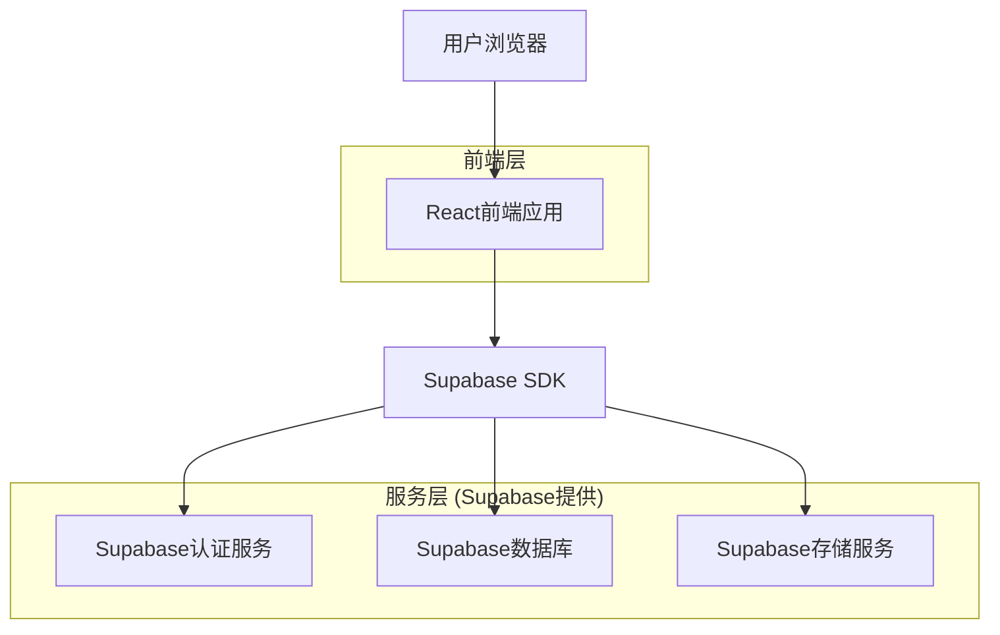

## 1. 架构设计



## 2. 技术描述

* **前端**: React\@18 + TailwindCSS\@3 + Vite

* **初始化工具**: vite-init

* **后端**: Supabase (BaaS)

* **认证**: Supabase Auth

* **数据库**: Supabase PostgreSQL

* **文件存储**: Supabase Storage

* **UI组件库**: HeadlessUI + Heroicons

## 3. 路由定义

| 路由            | 用途                |
| ------------- | ----------------- |
| /             | 首页，展示回忆时间轴和团队介绍   |
| /memory/:id   | 回忆播放页，展示单个回忆的详细内容 |
| /upload       | 回忆上传页，支持上传照片和视频   |
| /team/manage  | 团队管理页，管理员进行团队设置   |
| /profile      | 个人中心页，管理个人内容和设置   |
| /login        | 登录页，用户身份验证        |
| /register     | 注册页，新用户注册         |
| /invite/:code | 邀请页，通过邀请码加入团队     |

## 4. API定义

### 4.1 认证相关API

用户注册

```
POST /auth/v1/signup
```

请求:

| 参数名          | 参数类型   | 是否必需  | 描述     |
| ------------ | ------ | ----- | ------ |
| email        | string | true  | 用户邮箱地址 |
| password     | string | true  | 用户密码   |
| invite\_code | string | false | 团队邀请码  |

响应:

| 参数名     | 参数类型   | 描述     |
| ------- | ------ | ------ |
| user    | object | 用户信息对象 |
| session | object | 会话信息   |

### 4.2 回忆相关API

获取回忆列表

```
GET /rest/v1/memories
```

请求参数:

| 参数名      | 参数类型   | 是否必需  | 描述     |
| -------- | ------ | ----- | ------ |
| team\_id | uuid   | true  | 团队ID   |
| limit    | number | false | 返回数量限制 |
| offset   | number | false | 偏移量    |
| order    | string | false | 排序方式   |

上传回忆

```
graph TD
  A[用户浏览器] --> B[React前端应用]
  B --> C[Supabase SDK]
  C --> D[Supabase认证服务]
  C --> E[Supabase数据库]
  C --> F[Supabase存储服务]

  subgraph "前端层"
      B
  end

  subgraph "服务层 (Supabase提供)"
      D
      E
      F
  end
```

请求:

| 参数名          | 参数类型   | 是否必需  | 描述        |
| ------------ | ------ | ----- | --------- |
| title        | string | true  | 回忆标题      |
| description  | string | true  | 回忆描述      |
| media\_urls  | array  | true  | 媒体文件URL数组 |
| memory\_date | date   | true  | 回忆日期      |
| tags         | array  | false | 标签数组      |

## 5. 数据模型

### 5.1 数据模型定义


### 5.2 数据定义语言

用户表 (users)

```sql
-- 创建表
CREATE TABLE users (
    id UUID PRIMARY KEY DEFAULT gen_random_uuid(),
    email VARCHAR(255) UNIQUE NOT NULL,
    name VARCHAR(100) NOT NULL,
    avatar_url TEXT,
    created_at TIMESTAMP WITH TIME ZONE DEFAULT NOW(),
    updated_at TIMESTAMP WITH TIME ZONE DEFAULT NOW()
);

-- 创建索引
CREATE INDEX idx_users_email ON users(email);
CREATE INDEX idx_users_created_at ON users(created_at DESC);
```

团队表 (teams)

```sql
-- 创建表
CREATE TABLE teams (
    id UUID PRIMARY KEY DEFAULT gen_random_uuid(),
    name VARCHAR(255) NOT NULL,
    description TEXT,
    avatar_url TEXT,
    creator_id UUID REFERENCES users(id),
    is_public BOOLEAN DEFAULT true,
    created_at TIMESTAMP WITH TIME ZONE DEFAULT NOW()
);

-- 创建索引
CREATE INDEX idx_teams_creator_id ON teams(creator_id);
CREATE INDEX idx_teams_created_at ON teams(created_at DESC);
```

回忆表 (memories)

```sql
-- 创建表
CREATE TABLE memories (
    id UUID PRIMARY KEY DEFAULT gen_random_uuid(),
    team_id UUID REFERENCES teams(id) ON DELETE CASCADE,
    creator_id UUID REFERENCES users(id),
    title VARCHAR(255) NOT NULL,
    description TEXT,
    media_urls JSONB DEFAULT '[]',
    memory_date DATE NOT NULL,
    tags JSONB DEFAULT '[]',
    status VARCHAR(20) DEFAULT 'pending' CHECK (status IN ('pending', 'approved', 'rejected')),
    created_at TIMESTAMP WITH TIME ZONE DEFAULT NOW(),
    updated_at TIMESTAMP WITH TIME ZONE DEFAULT NOW()
);

-- 创建索引
CREATE INDEX idx_memories_team_id ON memories(team_id);
CREATE INDEX idx_memories_creator_id ON memories(creator_id);
CREATE INDEX idx_memories_memory_date ON memories(memory_date DESC);
CREATE INDEX idx_memories_status ON memories(status);
```

团队成唀表 (team\_members)

```sql
-- 创建表
CREATE TABLE team_members (
    id UUID PRIMARY KEY DEFAULT gen_random_uuid(),
    user_id UUID REFERENCES users(id) ON DELETE CASCADE,
    team_id UUID REFERENCES teams(id) ON DELETE CASCADE,
    role VARCHAR(20) DEFAULT 'member' CHECK (role IN ('admin', 'member')),
    joined_at TIMESTAMP WITH TIME ZONE DEFAULT NOW(),
    UNIQUE(user_id, team_id)
);

-- 创建索引
CREATE INDEX idx_team_members_user_id ON team_members(user_id);
CREATE INDEX idx_team_members_team_id ON team_members(team_id);
```

评论表 (comments)

```sql
-- 创建表
CREATE TABLE comments (
    id UUID PRIMARY KEY DEFAULT gen_random_uuid(),
    memory_id UUID REFERENCES memories(id) ON DELETE CASCADE,
    user_id UUID REFERENCES users(id) ON DELETE CASCADE,
    content TEXT NOT NULL,
    created_at TIMESTAMP WITH TIME ZONE DEFAULT NOW()
);

-- 创建索引
CREATE INDEX idx_comments_memory_id ON comments(memory_id);
CREATE INDEX idx_comments_user_id ON comments(user_id);
CREATE INDEX idx_comments_created_at ON comments(created_at DESC);
```

### 5.3 权限设置

```sql
-- 基本权限授予
GRANT SELECT ON users TO anon;
GRANT SELECT ON teams TO anon;
GRANT SELECT ON memories TO anon;
GRANT SELECT ON comments TO anon;

-- 认证用户权限
GRANT ALL PRIVILEGES ON users TO authenticated;
GRANT ALL PRIVILEGES ON teams TO authenticated;
GRANT ALL PRIVILEGES ON memories TO authenticated;
GRANT ALL PRIVILEGES ON team_members TO authenticated;
GRANT ALL PRIVILEGES ON comments TO authenticated;

-- RLS策略示例
ALTER TABLE memories ENABLE ROW LEVEL SECURITY;
CREATE POLICY "Public memories are viewable by everyone" ON memories
    FOR SELECT USING (is_public = true OR status = 'approved');

CREATE POLICY "Users can insert their own memories" ON memories
    FOR INSERT WITH CHECK (auth.uid() = creator_id);
```

