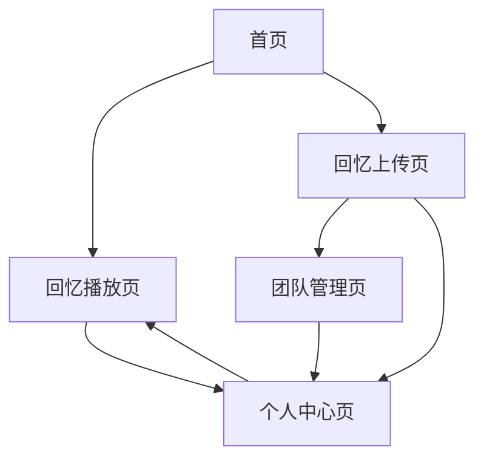

## 1. 产品概述
团队回忆播放网站是一个专为团队打造的多媒体回忆展示平台，让团队成员能够共同回顾珍贵的集体回忆。
- 解决团队回忆分散、难以集中展示的问题，为团队提供统一的回忆分享空间
- 适用于企业团队、学生组织、兴趣小组等需要保存和分享集体回忆的场景
- 通过温馨怀旧的设计风格，唤起团队成员的情感共鸣，增强团队凝聚力

## 2. 核心功能

### 2.1 用户角色
| 角色 | 注册方式 | 核心权限 |
|------|----------|----------|
| 访客用户 | 无需注册 | 浏览公开回忆内容 |
| 团队成员 | 邮箱注册+团队邀请码 | 上传回忆、评论互动、管理个人内容 |
| 团队管理员 | 初始创建者自动获得 | 管理团队设置、审核内容、邀请成员 |

### 2.2 功能模块
我们的团队回忆播放网站包含以下主要页面：
1. **首页**: 回忆时间轴、团队介绍、最新回忆展示
2. **回忆播放页**: 多媒体回忆展示、自动播放、互动评论
3. **回忆上传页**: 照片视频上传、回忆描述、标签分类
4. **团队管理页**: 成员管理、回忆审核、团队设置
5. **个人中心页**: 个人回忆管理、互动记录、个人设置

### 2.3 页面详情
| 页面名称 | 模块名称 | 功能描述 |
|----------|----------|----------|
| 首页 | 回忆时间轴 | 按时间顺序展示团队回忆，支持年份筛选和快速定位 |
| 首页 | 团队介绍 | 展示团队基本信息、成员数量、创建时间等 |
| 首页 | 最新回忆 | 轮播展示最新上传的回忆内容，包含缩略图和标题 |
| 回忆播放页 | 多媒体播放器 | 支持照片自动轮播和视频播放，提供全屏模式 |
| 回忆播放页 | 回忆详情 | 显示回忆标题、描述、上传者、上传时间等基本信息 |
| 回忆播放页 | 互动评论 | 支持用户评论、点赞，显示互动数量 |
| 回忆上传页 | 文件上传 | 支持批量上传照片和视频，自动压缩优化 |
| 回忆上传页 | 回忆描述 | 添加回忆标题、详细描述、参与成员标签 |
| 回忆上传页 | 分类标签 | 选择回忆类型（活动、旅行、聚会等）和自定义标签 |
| 团队管理页 | 成员列表 | 显示团队成员信息，支持搜索和权限管理 |
| 团队管理页 | 内容审核 | 审核新上传的回忆内容，支持通过/驳回操作 |
| 个人中心页 | 我的回忆 | 管理个人上传的回忆，支持编辑和删除 |
| 个人中心页 | 互动记录 | 查看个人的评论和点赞记录 |

## 3. 核心流程

### 访客用户流程
访客访问首页 → 浏览公开回忆时间轴 → 点击回忆进入播放页 → 观看回忆内容 → 可选择注册加入团队

### 团队成员流程
注册/登录 → 进入团队首页 → 浏览所有回忆 → 上传新回忆 → 等待审核 → 审核通过后自动展示 → 与其他成员互动评论

### 管理员流程
创建团队 → 设置团队信息 → 邀请成员 → 审核上传内容 → 管理团队设置 → 维护回忆秩序

## 4. 用户界面设计

### 4.1 设计风格
- **主色调**: 温暖琥珀色(#D4A574) + 奶油白(#FAF7F2) + 深棕色(#8B4513)
- **辅助色**: 淡金色(#F5E6D3)、暖灰色(#A0956B)
- **按钮风格**: 圆角矩形设计，采用渐变和阴影营造立体感
- **字体**: 主标题使用思源黑体，正文使用霞鹜文楷，营造中文阅读舒适感
- **布局风格**: 卡片式布局，大量留白，营造轻松愉悦的浏览体验
- **图标风格**: 线性图标配合圆角设计，保持视觉一致性

### 4.2 页面设计概述
| 页面名称 | 模块名称 | UI元素 |
|----------|----------|----------|
| 首页 | 回忆时间轴 | 垂直时间线设计，每个节点采用圆形徽章，悬停时有放大动效，背景使用渐变暖色 |
| 首页 | 团队介绍 | 大幅背景图配合半透明遮罩，文字采用大字号标题，营造电影开场感 |
| 首页 | 最新回忆 | 网格布局展示回忆缩略图，鼠标悬停时显示光晕效果，点击有波纹扩散动效 |
| 回忆播放页 | 多媒体播放器 | 全屏沉浸式播放，背景使用暗色渐变，控制栏采用半透明设计 |
| 回忆播放页 | 回忆详情 | 卡片式信息展示，边角圆润，阴影柔和，营造相册翻阅感 |
| 回忆上传页 | 文件上传 | 拖拽区域使用虚线边框，上传时有进度条和文件预览，成功后有庆祝动效 |
| 团队管理页 | 成员列表 | 头像采用圆形设计，在线状态用绿色小点标识，鼠标悬停显示详细信息 |

### 4.3 响应式设计
- **桌面端优先**: 以1920x1080为基准设计，充分利用大屏幕空间展示丰富内容
- **移动端适配**: 采用流式布局，在768px断点处切换为移动端布局
- **平板优化**: 在1024px断点处采用双栏布局，平衡内容展示和操作便利性
- **触摸交互**: 移动端支持滑动切换回忆、双指缩放图片、长按保存等手势操作

### 4.4 动效设计指导
- **页面切换**: 采用淡入淡出效果，持续时间300ms，营造温和过渡感
- **元素加载**: 使用渐显动效，从下方滑入，模拟回忆浮现的感觉
- **交互反馈**: 点击采用水波纹效果，悬停采用轻微放大和阴影加深
- **加载动画**: 使用复古胶片转动效果，呼应回忆主题
- **成功提示**: 采用礼花绽放动效，配合温暖色调，营造庆祝氛围